# Open Gestures

  

Super minimal and lightning-fast middle-button mouse gestures for Chrome. No complex configuration, just natural movements.

## 📥 Get it
Experience the fastest way to navigate the web. Click the badge below to install **Open Gestures** directly from the Chrome Web Store:

*Once on the store page, simply click **Add to Chrome** and confirm the installation.*

## 🚀 How to Use
Hold the **Middle Mouse Button** and swipe in any of the 8 directions below to trigger an action.

## 🛠 Features
- **Radial Detection:** 8 directions (U, D, L, R + diagonals) with equal 45° triggers.
- **Visual Trail:** Real-time SVG path showing your gesture.
- **Dynamic High-Contrast:** Automatically switches trail color based on the website's background.
- **Action Overlay:** Shows the recognized action at your cursor before you release.
- **Safety First:** Prevents accidental link clicks and middle-click autoscroll while gesturing.
- **Material Design 3:** Clean, modern options popup.

## 📦 Developer Installation
If you're contributing or using a local build:
1. Download or clone this repository.
2. Open Chrome and navigate to `chrome://extensions`.
3. Enable **Developer mode** in the top right.
4. Click **Load unpacked** and select this directory.

---
*Built with ❤️ for a faster web experience.*
